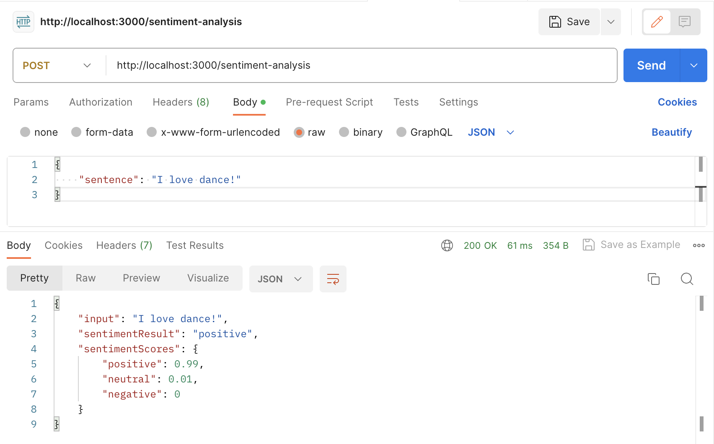

# **Project Overview**

This Project serves as an illustration of utilizing the Microsoft Azure Text Analytics API for sentence sentiment analysis. 

**Note:** For using this API you must have API endpoint and key.

## **Dependencies:**

This code requires the following libraries to be installed:


- `node and express`: For creating the server and handle incoming requests
- `@azure/ai-text-analytics`: To use the Text Analytics API specifically TextAnalyticsClient, AzureKeyCredential
- `dotenv`: To load environment variables from a .env file

## **Configuration:**

Please configure the `endpoint` and `key` variables with your own endpoint and key which can be obtained from Azure portal or environment variables.

https://azure.microsoft.com/en-us/products/ai-services/ai-language/

To learn how to register the app in Azure portal please follow:

https://learn.microsoft.com/en-us/azure/ai-services/language-service/sentiment-opinion-mining/quickstart?tabs=macos&pivots=programming-language-csharp

## **Instructions to run the Code:**

Install the dependencies:
1. `npm install`

Start the server using this commands:


2. `node app.js`

**Note:** Please make sure to set the `ENDPOINT` and `KEY` environment variables in a `.env` file in the root directory of the project.

## **Applications:**

The code sets up an Express app that listens for incoming POST requests to the `/sentiment-analysis`. The code then establishes an Express application designed to handle incoming POST requests directed to the `/sentiment-analysis` endpoint. A valid request should contain a `sentence` parameter with a string value in the request body such as:

```json
{
    "sentence": "I love apples!"
}
```

Upon receiving a valid request, the server retrieves the `sentence` parameter and forwards it to the client.`analyzeSentiment()` method to obtain the sentiment analysis result. Subsequently, the outcome is transmitted as a JSON object encompassing the `input` sentence, `sentimentResult`, and `sentimentScores`.

In the event of an error, the server will respond with a JSON object containing an error message that the body of the request must include a `sentence` parameter with a string value.

## **Testing:**

1. Open Postman and create a new request.
2. In the request URL field, enter the URL for the endpoint you want to hit, including the endpoint path `/sentiment-analysis`. For
example, http://localhost:3000/sentiment-analysis
3. Set the HTTP method to POST.
4. In the request body tab, select raw and set the data type to JSON.
5. In the JSON body, add a sentence field with the sentence you want to analyze for sentiment. 

**For example:**



